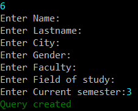

# University_Students_Database
Database project developed using the Scrum methodology, incorporating GoogleTest and TDD in the process.

# Student
This class represents a student in the database. It contains the following attributes:
- name
- lastname
- address
- city
- PESEL (personal identification number: unique 11 digits)
- gender (Male/Female/Other)
- index number (student identification number: unique 6 digits)
- faculty
- field of study
- current semester

# Database
Database is protected with loging system. To log in, you need to provide a username and a password. If you don't have an account, admin have to create you one. The database is stored in a file, so it is possible to save the changes and load them later. The database functionalities differ depending on the user's permissions.

# User
Regular user have access to the following functionalities:
- add a student
- edit a student
- find a student
- save database/query to file
- open database/query from file
- make new query
- show query

# Admin
Admin have additonal functionalities:
- delete a student
- add a user

# Tests
Tests are performed using GoogleTest. They are divided into two categories: unit tests and integration tests. Unit tests are performed on individual methods, while integration tests are performed on the entire class.

# How to work with the database?

### 1. Log in
Users credentials are stored in a file ```/resources/login.password```. If you don't have an account, admin have to create you one.

### 2. Choose the action
Pay attention that some actions are available only for admin.

 

# Functionalities

### 1. Add a student


### 2. Edit a student


### 3. Find a student
 

### 4. Delete a student [admin]


### 5. Save database/query to file


### 6. Open database/query from file


### 7. Make new query
 

### 8. Show query


### 9. Add a user [admin]
 